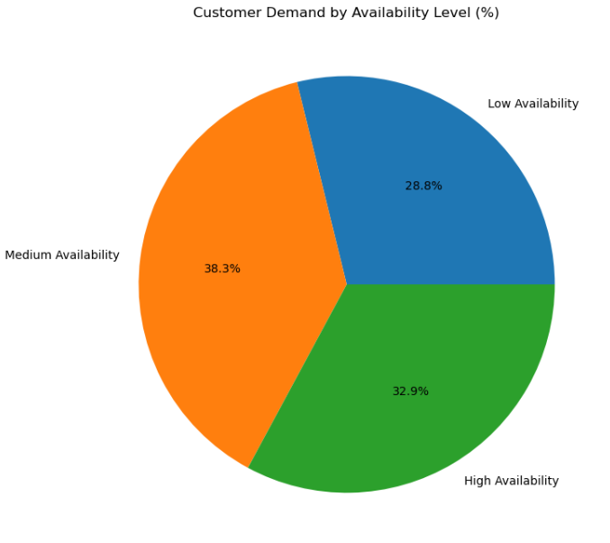

# NYC Airbnb Price Prediction & Market Analytics

## Project Overview

New York City’s Airbnb marketplace is one of the most competitive short-term rental ecosystems in the world, where pricing, customer demand, and occupancy behavior constantly shift across neighborhoods and property types.

This project was built to uncover the hidden market patterns driving Airbnb pricing and revenue performance across NYC using data analytics, business intelligence, visualization, and machine learning.

Using nearly **49,000 Airbnb listings**, this analysis explores:
- Which neighborhoods generate the highest revenue potential
- Which room types dominate customer demand
- Which properties appear underutilized or over-available
- How geographic location influences Airbnb pricing
- What factors most strongly impact listing prices

The objective was not just to predict Airbnb prices, but to transform raw marketplace data into actionable business intelligence for hosts, investors, and property managers.

---

# Dataset Summary

- **48,895 Airbnb listings analyzed**
- **16 original dataset features**
- Expanded into **234 engineered features** after preprocessing
- NYC boroughs included:
  - Manhattan
  - Brooklyn
  - Queens
  - Bronx
  - Staten Island

---

# Exploratory Business Analysis & Dashboard Development

## 1. Revenue & Pricing Intelligence Analysis

### Business Question
Which locations and property types generate the strongest revenue potential?

### Key Insights
- Manhattan recorded the highest average Airbnb pricing, nearly **125% higher** than Bronx listings.
- Entire homes/apartments contributed over **54% of total revenue potential** across NYC.
- Premium neighborhoods such as **Willowbrook ($249 avg price)**, **Neponsit ($237)**, and **Breezy Point ($213)** demonstrated the highest pricing power.

### Business Impact
- Premium neighborhoods create stronger investment opportunities for Airbnb hosts.
- Entire-home listings consistently outperform shared and private rooms in pricing performance.
- Strategic pricing optimization can improve profitability in lower-performing boroughs.

---

## 2. Room Type Market Share Analysis

### Business Question
Which room types dominate the NYC Airbnb marketplace?

### Key Insights
- Entire homes/apartments represented over **52%** of total Airbnb listings.
- Shared rooms accounted for only **2.3%** of listings, indicating significantly lower customer demand.
- Entire-home rentals generated the highest average prices across every borough.

### Business Impact
- Full-property rentals demonstrate the strongest customer preference and revenue generation potential.
- Hosts focusing on premium rental experiences may improve occupancy and profitability.
- Room-type segmentation strongly influences Airbnb pricing behavior.

---

## 3. Customer Demand & Occupancy Analysis

  

### Business Question
What factors indicate strong customer demand and booking activity?

### Key Insights
- Listings with medium availability averaged **39.3 customer reviews**, indicating stronger booking consistency.
- Shared rooms generated the highest average reviews per month (**1.48 reviews/month**), suggesting strong recurring engagement.
- Low availability combined with high review activity often indicated stronger occupancy and booking demand.

### Marketplace Metrics
- Average availability: **109.4 days/year**
- Average reviews per listing: **23.9**
- Average reviews per month: **1.38**

### Business Impact
- Customer review activity acts as a strong indicator of booking demand.
- Hosts can optimize occupancy through pricing adjustments and promotional strategies.
- Low-engagement listings may require improved visibility or pricing optimization.

---

## 4. Geographic Intelligence Analysis

### Business Question
How does geographic location influence Airbnb pricing and market demand?

### Key Insights
- Premium-priced listings were heavily concentrated in Manhattan and central NYC regions.
- Geographic clustering revealed strong neighborhood-level pricing behavior.
- Larger and denser listing clusters indicated stronger demand concentration and revenue potential.

### Business Impact
- Geographic intelligence helps identify high-performing investment neighborhoods.
- Hosts can benchmark pricing strategies against nearby competitors.
- Location remains one of the strongest predictors of Airbnb pricing behavior.

---

## 5. Availability Optimization Analysis

### Business Question
Which listings appear over-available or potentially underutilized?

### Key Insights
- High-availability listings remained open for booking significantly longer throughout the year, suggesting weaker occupancy performance.
- Approximately **32.9%** of customer demand came from highly available listings with inconsistent booking frequency.
- Neighborhoods such as **Co-op City**, **Willowbrook**, and **Spuyten Duyvil** recorded the highest average availability levels.

### Business Impact
- Over-available listings may indicate pricing inefficiencies or weaker market demand.
- Hosts can improve occupancy through better pricing strategies, promotions, and listing optimization.
- Availability analytics help identify underperforming properties.

---

# Data Preprocessing & Feature Engineering

## Data Cleaning & Processing
- Applied the **IQR (Interquartile Range) method** to detect and remove extreme pricing outliers.
- Approximately **6.08% of listings** were identified as upper-bound outliers and filtered to improve pricing distribution quality.
- Applied log transformation to reduce heavy price skewness and improve model performance.
- Encoded categorical variables using one-hot encoding and scaled numerical variables for machine learning optimization.

## Feature Engineering
Engineered advanced features including:
- Log-transformed pricing
- Neighborhood encoding
- Room-type segmentation
- Customer engagement metrics
- Availability-based demand indicators
- Days since last review

After preprocessing:
- Dataset expanded from **11 → 234 engineered features**

---

# Machine Learning Model Performance

## Models Evaluated
- Linear Regression
- Decision Tree
- Random Forest
- Gradient Boosting

| Model | RMSE | MAE | R² Score |
|---|---|---|---|
| Random Forest | 0.3484 | 0.2623 | 0.6311 |
| Gradient Boosting | 0.3511 | 0.2691 | 0.6251 |
| Linear Regression | 0.3680 | 0.2820 | 0.5882 |
| Decision Tree | 0.4839 | 0.3608 | 0.2882 |

---

# Best Performing Model

**Random Forest Regressor**

Random Forest achieved the strongest predictive performance with:
- **63.1% prediction accuracy**
- Lowest RMSE and MAE scores across all models
- Strong handling of nonlinear pricing behavior and outliers

### Performance Improvements
Compared to other models:
- Improved prediction performance by approximately **9% over Linear Regression**
- Outperformed Decision Tree models by over **119%**

### Most Influential Features
Feature importance analysis revealed:
- Entire home/apartment listings contributed over **40.3%** of pricing influence
- Geographic location contributed over **25%** of pricing behavior
- Customer engagement and availability strongly influenced demand patterns

These findings confirmed that:
- Location
- Room type
- Neighborhood demand
- Customer engagement

are the strongest drivers of Airbnb pricing across NYC.

---

# Technologies Used

- Python
- Pandas
- NumPy
- Matplotlib
- Seaborn
- Scikit-learn
- Jupyter Notebook

---

# Future Work

Currently expanding this project into a live interactive analytics platform by:
- Building a real-time Airbnb price prediction web application
- Deploying the machine learning model using Streamlit/Flask
- Hosting the platform online for public interaction
- Integrating live geographic dashboards and interactive market visualizations
- Adding real-time forecasting and dynamic pricing intelligence
